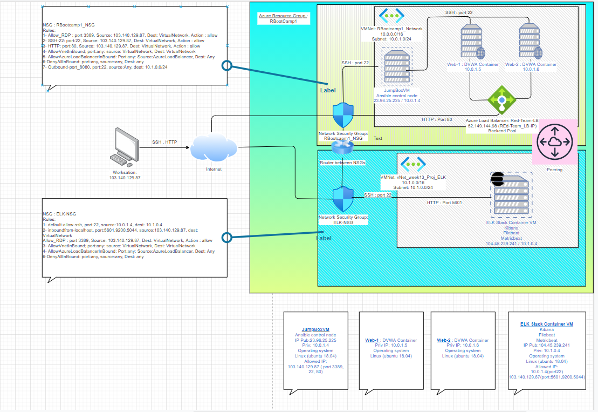
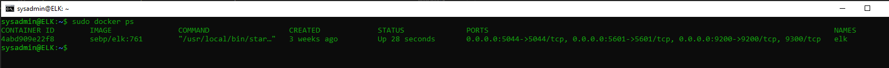

# <u>**Automated ELK Stack Deployment :**</u>
The files in this repository were used to configure the network depicted below. <br>  
 
[Network Diagram](https://github.com/Rishi-Chauhan-2020/BootCamp_Rep1/blob/main/Diagram/)




### <br><br>The configuration details of each machine may be found below.


| Name                 | Function     | IP Address   | Operating System   |
| :-------------       | :----------: | -----------: | -----------:       |
| Jump-Box-Provisioner | Gateway      | 10.0.1.4     | Linux-Ubuntu       |
| Web-1                | WebServer    | 10.0.1.5     | Linux-Ubuntu       |
| Web-2                | WebServer    | 10.0.1.6     | Linux-Ubuntu       |
| ELK                  | ELK Server   | 10.1.0.4     | Linux-Ubuntu       |
|                      |              |              |                    |

### <br><u>**How to use Ansible Build**</u>
<br>
These Ansible scripts have been tested and used to generate a live ELK deployment on Azure. They can be used to either recreate the entire deployment pictured above. Alternatively, select portions of the ansible YML script file may be used to install only certain pieces of it, such as Filebeat.<br> 

Loaction of Ansible scripts: <u>[YML Scripts](https://github.com/Rishi-Chauhan-2020/BootCamp_Rep1/blob/main/Ansible)</u>

| Name of script                   | Function                                                                                                                                                   |
| :-------------                   | :--------------------------------------------------------------------------------------------------------------------------------------------------------: | 
| my-playbook.yml.txt              | This script will install Apache2 on Webservers.<br> Webserver's IP address shall be defined <br> in host file of Ansible                                            | 
| playbook-docker-python3.yml.txt  | This script will configure webserver virtual <br> machines with Docker, Python and setup <br> DVWA container                                                         |
| install-elk.yml.txt              | This script will configure ELK virtual mahcine <br> with docker, install python, increase <br>virtual memory to 262144, configure ELK with <br>ports 5601/9200/5044     | 
| metricbeat-playbook.yml.txt      | This script will install and configure webservers <br> with metricbeat  | 
| filebeat-playbook.yml.txt        | This script will install and configure webservers <br>with filebeat    |
|                                  |              |
<br>


### <u>**High Availability**</u> :
 Load balancing ensures that the application will be high availability. Load Balancer is put in with two webservers ( web-1 & Web-2) in backend pool, with a health probe to monitor the webservers hosting DVWA (D*am Vulnerable Web Application). Loadbalancer public IP fronts and restrict network access. <br>

|Load Balancer :       | Red-Team-LB                                                        | 
| :-------------------:| :----------------------------------------------------------------: | 
| Backend pool         | RedTeam-LB-Backendpool (2 virtual machines)<br>web-1 and Web-2     | 
| Health probe         | RedTeamProbe (Tcp:80)                                              |
| Load balancing rule  | REd_team_LB_port80_fwdto_VNet (Tcp/80)                             |
| Public IP address    | 52.149.144.98 (REd-Team_LB-IP)                                     |
|                      |              |

<br>

Primary function of a load balancer is to spread workloads across multiple servers to prevent overloading servers, optimize productivity, and maximize uptime. Load balancers also add resiliency by rerouting live traffic from one server to another if a server falls prey to DDoS attacks or otherwise becomes unavailable. In this way, load balancers help to eliminate single points of failure, reduce the attack surface, and make it harder to exhaust resources and saturate links.

We also have a Jumpbox server which act as a gateway.A jump server, jump host or jump box is a system on a network used to access and manage devices in a separate security zone. A jump server is a hardened and monitored device that spans two dissimilar security zones and provides a controlled means of access between them. In our setup, access policies only allow inbound ssh connections to jumpbox and not to any other VM, thus preventing exposure.


Integrating an ELK server allows users to easily monitor the vulnerable VMs for changes to the logs and system traffic.

### **Filebeat & Metricbeat**<br>
Installed as an agent on our webservers ( Web-1 and Web-2), Filebeat monitors the log files or locations that we specify, collects log events, and forwards them to Elasticsearch / logstash for indexing
Metricbeat is also installed as agent on our webservers (Web-1 and Web-2),  it collects system-level CPU usage, memory, file system, disk IO, and network IO statistics, as well as top-like statistics for every process running


### <br>**Access Policies**<br>

The machines on the internal network are not exposed to the public Internet.
Only the Jumpserver machine(Jump-Box-Provisioner) can accept connections from the Internet. Access to this machine is only allowed from the following IP addresses: 103.140.129.87,49.36.167.231

Machines within the network can only be accessed by Jumpserver server:<br>
Jump-Box-Provisioner (10.0.1.4)

A summary of the access policies in place can be found in the table below.<br>


| Name                 | Publicly Accessible | Allowed IP Addresses            | Protocol (port)    |
| :-------------       | :----------:        | -----------:                    | -----------:       |
| Jump-Box-Provisioner | Yes                 | 103.140.129.87  & 49.36.167.231 | SSH(22), RDP(3389) |
| Web-1                | No                  | N/A                             | N/A                |
| Web-2                | No                  | N/A                             | N/A                |
| Red-Team-LB          | Yes                 | 103.140.129.87  & 49.36.167.231 | HTTP(80)           |
| ELK                  | Yes                 | 103.140.129.87  & 49.36.167.231 | HTTP(5601)         |
|                      |                     |                                 |                    |
<br>


### **Elk Configuration**
Ansible was used to automate configuration of the ELK machine. No configuration was performed manually, which is advantageous because it dramatically improves the scalability, consistency, and reliability of your IT environment.It can manage the infrastructure, networks, operating systems and services that we are already using. Ansible provides Orchestration in the sense of aligning the business request with the applications, data, and infrastructure

The playbook implements the following tasks:<br>  
1- Install Docker<br> 
2- Install Python<br> 
3- Assign Virtual memory 262144<br>
4- Download and configure docker ELK container to start and use ports 5601, 9200, 5044.<br> 

The following screenshot displays the result of running docker ps after successfully configuring the ELK instance.




### <u>Target Machines & Beats</u>
This ELK server is configured to monitor the following machines:

| Name                 | IP Addresses  (priv)| Role          |
| :-------------       | :----------:        | -----------:  |
| Web-1                | 10.0.1.5            | Webserver     |
| Web-2                | 10.0.1.6            | Webserver     |
|                      |                     |               |
<br>

We have installed the following Beats on these machines:

- Metricbeat - 7.6.1
- Filebeat - 7.6.1

These Beats allow us to collect the following information from each machine:

#### <u>Metricbeat</u>:
Metricbeat is a lightweight shipper that you can install on your servers to periodically collect metrics from the *`operating system and from services running`* on the server. Metricbeat takes the metrics and statistics that it collects and ships them to the output that we specify. Such as in this setup, we have Metricbeat installed on our Webservers ( Web-1 & Web-2 ), it collects and ship it to the Elasticsearch VM (ELK) we have.

 <u>Metricbeat features</u>:
 - System-Level Monitoring
 - System-Level CPU usage statistics
 - Network IO statistics

#### <u>Filebeat</u>:
 Filebeat is a lightweight shipper for forwarding and centralizing log data. Installed as an agent on your servers, Filebeat monitors the *`log files or locations that you specify`*, collects log events, and forwards them to Elasticsearch, in this case ship them to our ELK VM

### <u>Using the Playbooks</u>
In order to use the playbook, you will need to have an Ansible control node already configured along with the destination node. Assuming you have such a control node provisioned:<br>
- SSH into the control node
- Copy the *`playbook-docker-python3.yml, metricbeat-playbook.yml, filebeat-playbook.yml, install-elk.yml `* files to your ansible control node's *`/etc/ansible/files`*.
- Update the *`/etc/anshible/hosts`* file to include *`IP address of Webservers`*
- Update the *`/etc/anshible/hosts`* file to include *`IP address of Elasticsearch server`*

    This will tell Playbook which hosts to install ELK vs which host to install filebeat and metricbeat. Example:

   ```
  [ webservers ]
  `IP address of webserver` ansible_python_interpreter=/usr/bin/python3
  [elk]
  `IP address of Elasticsearch server` ansible_python_interpreter=/usr/bin/python3

  ```

    The Playbook will define this in `host section`
  ```
    ---
    - name: Configure Elk VM with Docker
      hosts: elk
      remote_user: sysadmin
      become: true
      tasks:
  ```

- From control node run the playbook *`ansible-playbook playbook-docker-python3.yml`*. This will setup Webservers with docker, python and DVWA container.
- Run playbook *`ansible-playbook metricbeat-playbook.yml`* & *`ansible-playbook filebeat-playbook.yml`* , these will install Filebeat and Metricbeat on Webservers.
- Run playbook *`ansible-playbook install-elk.yml`*, this will install and configure Elasticsearch VM with docker, python, set vitrual memory and install ELK container


Verification once playbooks are run:

- <u>For Webservers - DVWA</u>: navigate to `http://IPofWebLoadbalancer/index.php` to check that the installation worked as expected. You will see the webpage as :

    


- <u>For Elasticsearch server</u>: navigate to `http://IPofELK_server:5601/app/kibana#/home` to check that the installation worked as expected. You will see the webpage as :

    


<br>


- Command to download Playbooks :
  ```
    wget -c https://github.com/Rishi-Chauhan-2020/BootCamp_Rep1/tree/main/Ansible/Playbooks.zip
  ```
